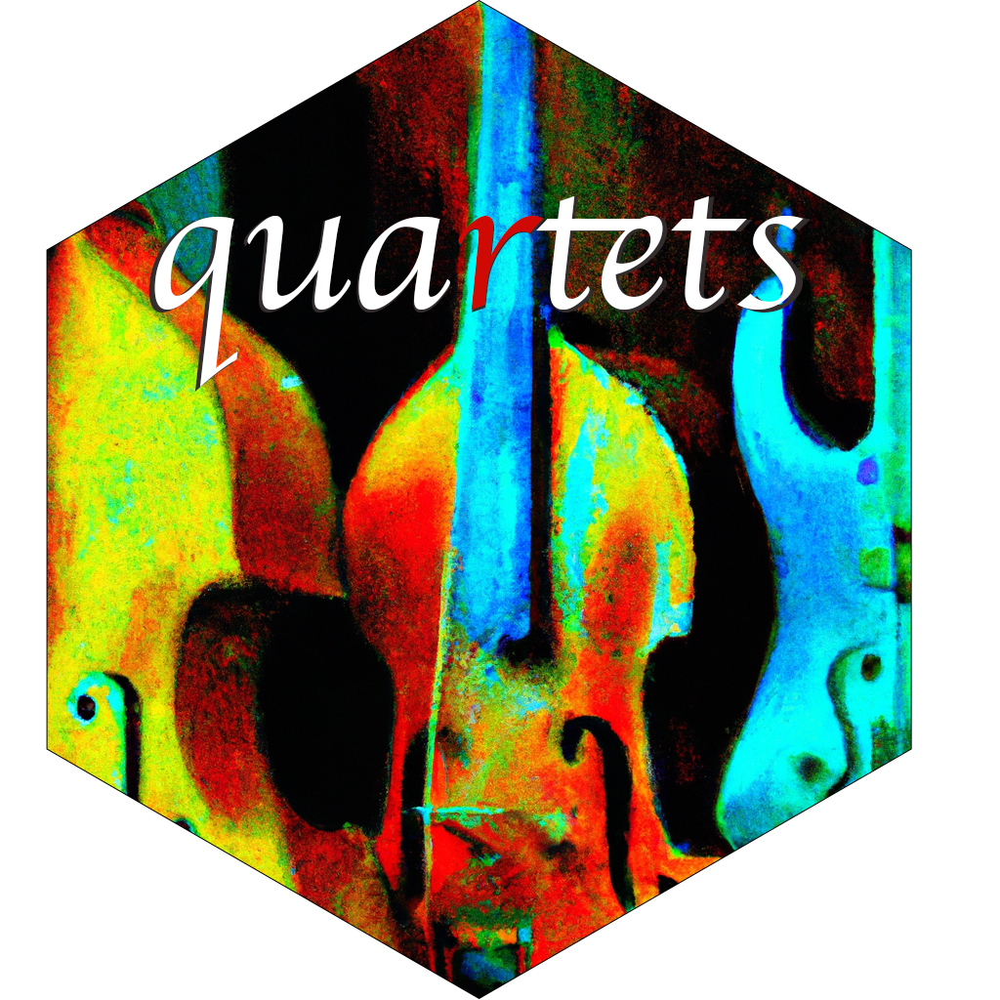
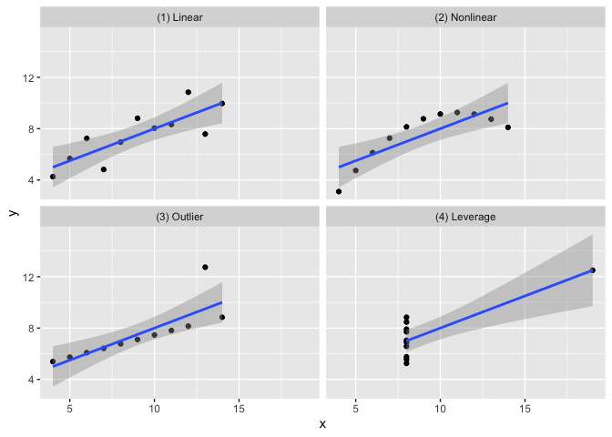
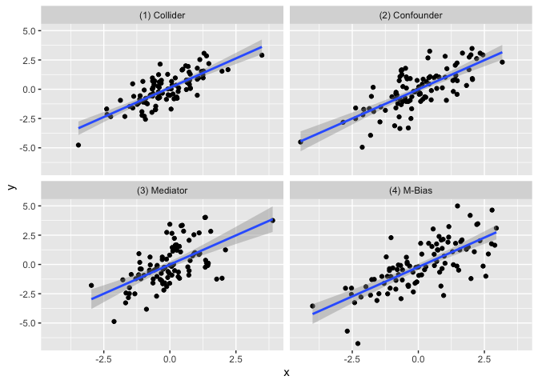
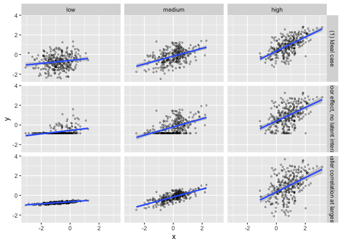
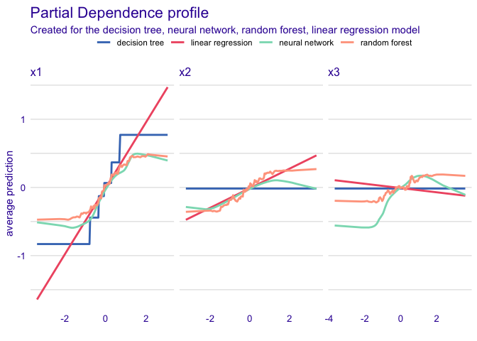
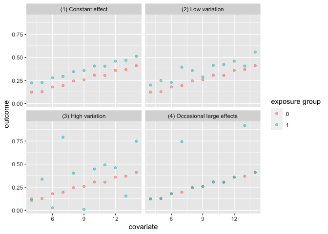
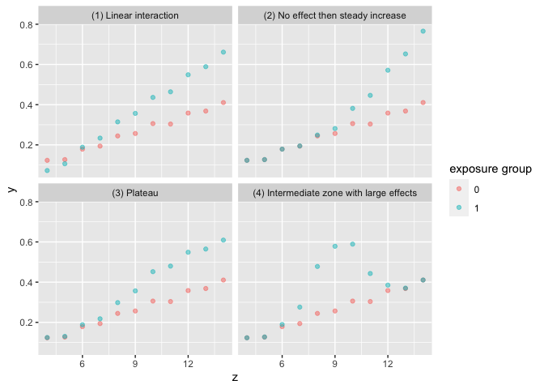

<!-- README.md is generated from README.Rmd. Please edit that file -->

# quartets: Datasets to help teach statistics 

<!-- badges: start -->

[](https://github.com/r-causal/quartets/actions)
<!-- badges: end -->

**Authors:** [Lucy D’Agostino
McGowan](https://www.lucymcgowan.com/)<br/> **License:**
[MIT](https://opensource.org/license/mit/)

The quartets package is a collection of datasets aimed to help data
analysis practitioners and students learn key statistical insights in a
hands-on manner. It contains:

- Anscombe’s Quartet
- Causal Quartet
- Datasaurus Dozen
- Interaction Triptych
- Rashomon Quartet
- Gelman Variation and Heterogeneity Causal Quartets

## Installation

You can install the development version of quartets like so:

``` r
devtools::install_github("r-causal/quartets")
```

## Anscombe’s Quartet

The goal of the `anscombe_quartet` data set is to help drive home the
point that visualizing your data is important. Francis Anscombe
generated these four datasets to demonstrate that statistical summary
measures alone cannot capture the full relationship between two
variables (here, `x` and `y`). Anscombe emphasized the importance of
visualizing data prior to calculating summary statistics.

- Dataset 1 has a linear relationship between `x` and `y`  
- Dataset 2 has shows a nonlinear relationship between `x` and `y`  
- Dataset 3 has a linear relationship between `x` and `y` with a single
  outlier  
- Dataset 4 has shows no relationship between `x` and `y` with a single
  outlier that serves as a high-leverage point.

In each of the datasets the following statistical summaries hold:

- mean of `x`: 9  
- variance of `x`: 11  
- mean of `y`: 7.5  
- variance of y: 4.125  
- correlation between `x` and `y`: 0.816  
- linear regression between `x` and `y`: `y = 3 + 0.5x`  
- $R^2$ for the regression: 0.67

## Example

``` r
library(tidyverse)
library(quartets)

ggplot(anscombe_quartet, aes(x = x, y = y)) +
  geom_point() + 
  geom_smooth(method = "lm", formula = "y ~ x") +
  facet_wrap(~dataset)
```



``` r

anscombe_quartet |>
  group_by(dataset) |>
  summarise(mean_x = mean(x),
            var_x = var(x),
            mean_y = mean(y),
            var_y = var(y),
            cor = cor(x, y)) |>
  knitr::kable(digits = 2)
```

| dataset         | mean_x | var_x | mean_y | var_y |  cor |
|:----------------|-------:|------:|-------:|------:|-----:|
| \(1\) Linear    |      9 |    11 |    7.5 |  4.13 | 0.82 |
| \(2\) Nonlinear |      9 |    11 |    7.5 |  4.13 | 0.82 |
| \(3\) Outlier   |      9 |    11 |    7.5 |  4.12 | 0.82 |
| \(4\) Leverage  |      9 |    11 |    7.5 |  4.12 | 0.82 |

## Causal Quartet

The goal of the `causal_quartet` data set is to help drive home the
point that when presented with an exposure, outcome, and some measured
factors, statistics alone, whether summary statistics or data
visualizations, are not sufficient to determine the appropriate causal
estimate. Additional information about the data generating mechanism is
needed in order to draw the correct conclusions. See [this
paper](https://github.com/LucyMcGowan/writing-quartet/blob/main/manuscript.pdf)
for details.

## Example

``` r
ggplot(causal_quartet, aes(x = exposure, y = outcome)) +
  geom_point() + 
  geom_smooth(method = "lm", formula = "y ~ x") +
  facet_wrap(~dataset)
```



``` r
causal_quartet |>
  nest_by(dataset) |>
  mutate(`Y ~ X` = round(coef(lm(outcome ~ exposure, data = data))[2], 2),
         `Y ~ X + Z` = round(coef(lm(outcome ~ exposure + covariate, data = data))[2], 2),
         `Correlation of X and Z` = round(cor(data$exposure, data$covariate), 2)) |>
  select(-data, `Data generating mechanism` = dataset) |>
  knitr::kable()
```

| Data generating mechanism | Y \~ X | Y \~ X + Z | Correlation of X and Z |
|:--------------------------|-------:|-----------:|-----------------------:|
| \(1\) Collider            |      1 |       0.55 |                    0.7 |
| \(2\) Confounder          |      1 |       0.50 |                    0.7 |
| \(3\) Mediator            |      1 |       0.00 |                    0.7 |
| \(4\) M-Bias              |      1 |       0.88 |                    0.7 |

## Datasaurus Dozen

Similar to Anscombe’s Quartet, the Datasaurus Dozen has additional data
sets where the mean, variance, and Pearson’s correlation are identical,
but visualizations demonstrate the large difference between datasets.
This dataset is re-exported from the
[datasauRus](https://CRAN.R-project.org/package=datasauRus) R package.

## Example

``` r
ggplot(datasaurus_dozen, aes(x = x, y = y)) +
  geom_point() + 
  geom_smooth(method = "lm", formula = "y ~ x") +
  facet_wrap(~dataset)
```


``` r

datasaurus_dozen |>
  group_by(dataset) |>
  summarise(mean_x = mean(x),
            var_x = var(x),
            mean_y = mean(y),
            var_y = var(y),
            cor = cor(x, y)) |>
  knitr::kable(digits = 2)
```

| dataset    | mean_x |  var_x | mean_y |  var_y |   cor |
|:-----------|-------:|-------:|-------:|-------:|------:|
| away       |  54.27 | 281.23 |  47.83 | 725.75 | -0.06 |
| bullseye   |  54.27 | 281.21 |  47.83 | 725.53 | -0.07 |
| circle     |  54.27 | 280.90 |  47.84 | 725.23 | -0.07 |
| dino       |  54.26 | 281.07 |  47.83 | 725.52 | -0.06 |
| dots       |  54.26 | 281.16 |  47.84 | 725.24 | -0.06 |
| h_lines    |  54.26 | 281.10 |  47.83 | 725.76 | -0.06 |
| high_lines |  54.27 | 281.12 |  47.84 | 725.76 | -0.07 |
| slant_down |  54.27 | 281.12 |  47.84 | 725.55 | -0.07 |
| slant_up   |  54.27 | 281.19 |  47.83 | 725.69 | -0.07 |
| star       |  54.27 | 281.20 |  47.84 | 725.24 | -0.06 |
| v_lines    |  54.27 | 281.23 |  47.84 | 725.64 | -0.07 |
| wide_lines |  54.27 | 281.23 |  47.83 | 725.65 | -0.07 |
| x_shape    |  54.26 | 281.23 |  47.84 | 725.22 | -0.07 |

## Interaction Triptych

This set of 3 datasets demonstrating that while the slopes estimated by
a simple linear interaction model may be the same, the underlying
data-generating mechanisms can be vastly different.

``` r
ggplot(interaction_triptych, aes(x, y)) +
  geom_point(shape = "o") +
  geom_smooth(method = "lm", formula = "y ~ x") + 
  facet_grid(dataset ~ moderator)
```



## Rashomon Quartet

This dataset demonstrates that model diagnostics alone (such as $R^2$
and RMSE) do not tell the full story of a prediction model. Here, there
are three predictors and one outcome. Models fit using a regression
tree, linear regression, random forest, and neural network all yield the
same $R^2$ and RMSE, but are finding different relationships between the
predictors, as evidenced by the below partial dependence plots.

``` r
set.seed(1568)
library(tidymodels)
library(DALEXtra)
```

``` r
rec <- recipe(y ~ ., data = rashomon_quartet_train)

## Regression Tree

wf_tree <- workflow() |>
  add_recipe(rec) |>
  add_model(
    decision_tree(mode = "regression", engine = "rpart",
                  tree_depth = 3, min_n = 250)
  )

tree <- fit(wf_tree, rashomon_quartet_train)
exp_tree <- explain_tidymodels(
  tree, 
  data = rashomon_quartet_test[, -1], 
  y = rashomon_quartet_test[, 1],
  verbose = FALSE, 
  label = "decision tree")

## Linear Model

wf_linear <- wf_tree |>
  update_model(linear_reg())

lin <- fit(wf_linear, rashomon_quartet_train)
exp_lin <- explain_tidymodels(
  lin, 
  data = rashomon_quartet_test[, -1], 
  y = rashomon_quartet_test[, 1],
  verbose = FALSE, 
  label = "linear regression")

## Random Forest

wf_rf <- wf_tree |>
  update_model(rand_forest(mode = "regression", 
                           engine = "randomForest", 
                           trees = 100))

rf <- fit(wf_rf, rashomon_quartet_train)
exp_rf <- explain_tidymodels(
  rf, 
  data = rashomon_quartet_test[, -1], 
  y = rashomon_quartet_test[, 1],
  verbose = FALSE, 
  label = "random forest")

## Neural Network

library(neuralnet)
nn <- neuralnet(
  y ~ ., 
  data = rashomon_quartet_train, 
  hidden = c(8, 4), 
  threshold = 0.05)

exp_nn <- explain_tidymodels(
  nn, 
  data = rashomon_quartet_test[, -1], 
  y = rashomon_quartet_test[, 1],
  verbose = FALSE, 
  label = "neural network")
```

We can see that each of these models “perform” the same.

``` r
mp <- map(list(exp_tree, exp_lin, exp_rf, exp_nn), model_performance)
tibble(
  model = c("Decision tree", "Linear regression", "Random forest", "Neural network"),
  R2 = map_dbl(mp, ~.x$measures$r2),
  RMSE = map_dbl(mp, ~.x$measures$rmse)
  ) |>
  knitr::kable(digits = 2)
```

| model             |   R2 | RMSE |
|:------------------|-----:|-----:|
| Decision tree     | 0.73 | 0.35 |
| Linear regression | 0.73 | 0.35 |
| Random forest     | 0.73 | 0.35 |
| Neural network    | 0.73 | 0.35 |

But the way they fit to the actual predictors is quite different:

``` r
pd_tree <- model_profile(exp_tree, N=NULL)
pd_lin <- model_profile(exp_lin, N=NULL)
pd_rf <- model_profile(exp_rf, N=NULL)
pd_nn <- model_profile(exp_nn, N=NULL)
plot(pd_tree, pd_nn, pd_rf, pd_lin)
```



## Gelman Variation and Heterogeneity Causal Quartets

The first set of data `variation_causal_quartet` demonstrates that you
can get the same average treatment effect despite variability across
some pre-treatment characteristic (here called `z`).

``` r
ggplot(variation_causal_quartet, aes(x = covariate, y = outcome, color = factor(exposure))) + 
  geom_point(alpha = 0.5) + 
  facet_wrap(~ dataset) + 
  labs(color = "exposure group")
```



``` r

variation_causal_quartet |>
  nest_by(dataset) |>
  mutate(ATE = round(coef(lm(outcome ~ exposure, data = data))[2], 2)) |>
  select(-data, dataset) |>
  knitr::kable()
```

| dataset                        | ATE |
|:-------------------------------|----:|
| \(1\) Constant effect          | 0.1 |
| \(2\) Low variation            | 0.1 |
| \(3\) High variation           | 0.1 |
| \(4\) Occasional large effects | 0.1 |

The `heterogeneous_causal_quartet` demonstrates how you can observe the
same causal effect under different patterns of treatment heterogeneity.

``` r
ggplot(heterogeneous_causal_quartet, aes(x = covariate, y = outcome, color = factor(exposure))) + 
  geom_point(alpha = 0.5) + 
  facet_wrap(~ dataset) + 
  labs(color = "exposure group")
```



``` r

heterogeneous_causal_quartet |>
  nest_by(dataset) |>
  mutate(ATE = round(coef(lm(outcome ~ exposure, data = data))[2], 2)) |>
  select(-data, dataset) |>
  knitr::kable()
```

| dataset                                    | ATE |
|:-------------------------------------------|----:|
| \(1\) Linear interaction                   | 0.1 |
| \(2\) No effect then steady increase       | 0.1 |
| \(3\) Plateau                              | 0.1 |
| \(4\) Intermediate zone with large effects | 0.1 |

## References

Anscombe, F. J. (1973). “Graphs in Statistical Analysis”. American
Statistician. 27 (1): 17–21. <doi:10.1080/00031305.1973.10478966>. JSTOR
2682899.

Biecek P, Baniecki H, Krzyziński M, Cook D (2023). Performance is not
enough: the story of Rashomon’s quartet. Preprint arXiv:2302.13356v2.

D’Agostino McGowan L, Barrett M (2023). Causal inference is not a
statistical problem. Preprint arXiv:2304.02683v1.

Davies R, Locke S, D’Agostino McGowan L (2022). *datasauRus: Datasets
from the Datasaurus Dozen*. R package version 0.1.6,
<https://CRAN.R-project.org/package=datasauRus>.

Gelman, A., Hullman, J., & Kennedy, L. (2023). Causal quartets:
Different ways to attain the same average treatment effect. arXiv
preprint arXiv:2302.12878.

Hullman J (2023). *causalQuartet: Create Causal Quartets for
Interrogating Average Treatment Effects*. R package version 0.0.0.9000.

Matejka, J., & Fitzmaurice, G. (2017). Same Stats, Different Graphs:
Generating Datasets with Varied Appearance and Identical Statistics
through Simulated Annealing. CHI 2017 Conference proceedings: ACM SIGCHI
Conference on Human Factors in Computing Systems. Retrieved from
<https://www.autodesk.com/research/publications/same-stats-different-graphs>

Rohrer, Julia M., and Ruben C. Arslan. “Precise answers to vague
questions: Issues with interactions.” Advances in Methods and Practices
in Psychological Science 4.2 (2021): 25152459211007368.
